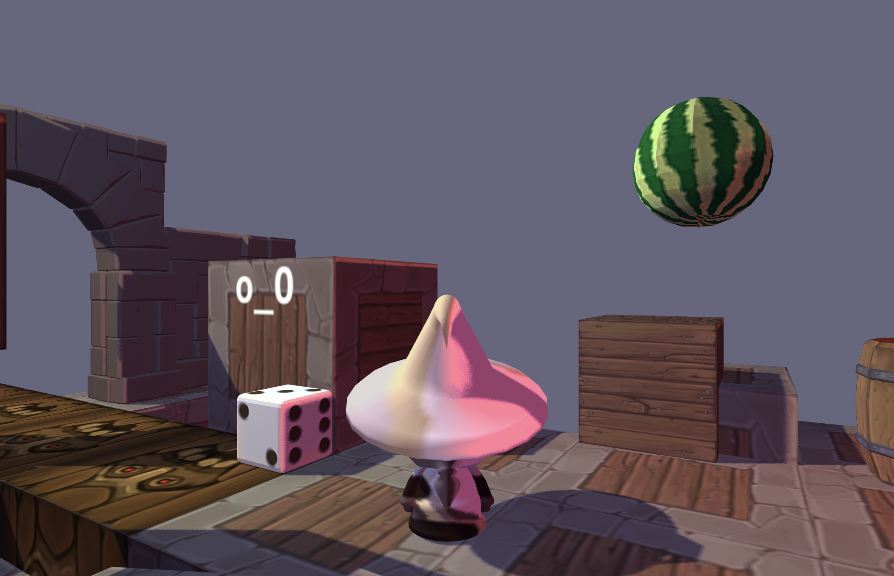

Demo: https://ratrecommends.github.io/defold-3d-experiment/

Controls: WASD+Space+mouse rotation

Acknowledgments:
- based on Dragosha's [shadow mapping example](https://github.com/Dragosha/defold-things/blob/master/shadowmap);
- uses [kinematic walker](https://github.com/astrochili/defold-kinematic-walker) and [operator](https://github.com/astrochili/defold-operator) libraries.